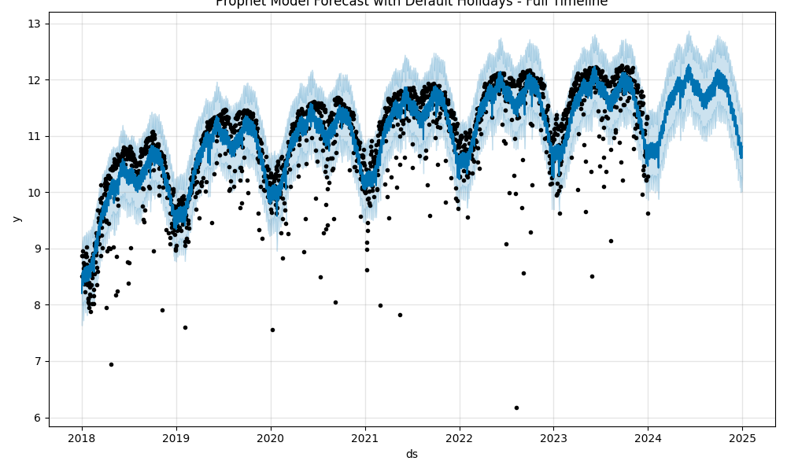

# Prophet 모델에 공휴일 올바르게 입력하기

**소스코드 분석 기반 대한민국 시계열 예측 정확도 비교**

자유전공학부 서현빈 (2016-16817)

---

## 1. 서론

시계열 예측 분야에서 Prophet 모델은 Taylor와 Letham(2018)에 의해 개발된 이후 널리 사용되고 있는 대표적인 예측 모델이다. 이 모델의 주요 특징 중 하나는 트렌드, 계절성과 함께 공휴일과 같은 특수 이벤트를 예측 모델에 포함시킬 수 있다는 점이다.

그러나 2017년 2월 23일 오픈소스로 공개된 최초의 Prophet 버전과 현재 버전 사이에는 상당한 변화가 있었으며, 특히 공휴일 처리 관련 코드는 근본적으로 재설계되었다. 이러한 변화로 인해 공휴일 데이터를 입력하는 방식과 그 효과가 달라졌음에도 불구하고, 이에 대한 체계적인 분석은 부족한 상황이다.

본 연구는 Prophet 파이썬 라이브러리 분석을 통해 모델의 설계 의도에 맞는 올바른 공휴일 입력 방법을 확인하고, 대한민국의 공휴일 데이터를 바탕으로 시계열 예측 정확도에 미치는 영향을 비교 분석하고자 한다. 이를 통해 실무에서 Prophet 모델을 활용할 때 공휴일 데이터의 적절한 처리 방안을 제시하고자 한다.

## 2. 최초의 공휴일 모델링

Taylor와 Letham(2018)의 Prophet 모델에서는 다음 사항을 강조한다.

- **전체 공휴일 목록의 필수성**: 과거, 현재, 그리고 미래의 공휴일을 모두 열거해야 한다. 훈련 기간뿐만 아니라 예측 기간의 공휴일 정보까지 미리 입력되어 있어야 예측을 수행할 수 있기 때문이다.
- **다양한 공휴일 지원과 확장성**: 공휴일 열거를 돕기 위해 전 세계적으로 통용되는 공휴일(예: 크리스마스)과 특정 국가별 공휴일(예: 미국 추수감사절)을 기본 제공한다. 그 외에도 연구자가 수기로 추가 입력할 수 있으므로 대통령 선거와 같이 특정 연도에만 발생하는 공휴일도 반영할 수 있다.
- **음력 공휴일 지원**: 공휴일 열거 방식에 기반하므로 특정 공휴일의 날짜가 양력 기준 매년 동일하지 않아도 된다. 연구진은 특정 공휴일의 효과가 매년 유사할 수 있음을 강조하면서 공휴일을 요인으로 간주해야 함을 언급했고, 이러한 공휴일이 음력이어도 됨을 명시한다.
- **공휴일 전후 효과 반영**: 공휴일 당일의 효과뿐만 아니라 공휴일 전후 효과까지 고려하여 실제 공휴일 패턴을 보다 현실적으로 반영한다(예: 미국 추수감사절 주말).

<br>

## 3. 변화된 공휴일 모델링

Duong(2023)에서는 향후 Prophet 개발 방향을 논의하며 모델 자체에는 큰 변화가 없을 것임을 선언했다. 대신 설치 용이성, 사용성, 문서 개선을 예고했다. 공휴일의 경우 파이썬에서 널리 사용되는 `holidays` 패키지와의 결합을 통해 최신 공휴일을 보다 잘 반영할 것임을 밝혔다. 해당 글이 작성되고 3개월 후 배포된 `1.1.4` 버전에서 Prophet 자체 공휴일 데이터를 전혀 사용하지 않는 방향으로 수정되었으며, 2024년 9월 `1.1.6` 버전에서는 `holidays>=0.25,<1`만을[^1] 사용하도록 그 버전이 보다 구체화되었다.

[^1]: `holidays` 개발진에 따르면 `v0.x`와 `v1`은 서로 호환되지 않을 것이며, 이러한 원치 않는 업그레이드를 막기 위해 Prophet 개발진도 `<1`로 조치를 취해두었다. Prophet 모델 자체에 큰 변화가 없을 것이므로, 본 연구의 내용도 차세대 Prophet이 나오지 않는 이상 유효할 것이다.

`prophet>=1.1.4,<1.1.8` 기준으로 그 의존성으로 `holidays>=0.37,<0.75`를[^2] 설치하는 것이 권장된다. 물론 기존 및 신규 프로젝트의 경우 `prophet`은 최신 버전으로, `holidays`는 이에 호환되는 최신 버전으로 업데이트하는 것이 이상적이다. 특히 후자를 업데이트해야만 매년 추가되는 임시 공휴일이 반영되므로 최신 데이터 분석에 있어서는 필수적이다. 다음은 `holidays` 패키지의 주요 수정 내역이다:

[^2]: 본 연구를 작성하는 시점에서는 `prophet@1.1.7`, `holidays@0.75` 버전이 최신이므로 최대 버전 제약을 설정했다. 추후 두 라이브러리의 공휴일 로직에 변화가 없으면 본 문서의 내용도 유효하다.

- [v0.71](https://github.com/vacanza/holidays/releases/tag/v0.71): 2025년 임시 공휴일 추가 (대통령 선거)
- [v0.65](https://github.com/vacanza/holidays/releases/tag/v0.65): 2025년 임시 공휴일 추가 (임시공휴일, 1월 27일)
- [v0.57](https://github.com/vacanza/holidays/releases/tag/v0.57): 2024년 임시 공휴일 추가 (국군의 날)
- [v0.37](https://github.com/vacanza/holidays/releases/tag/v0.37): ~2023년 임시 공휴일 추가, 대통령 선거일 계산 로직 추가
- [v.0.30](https://github.com/vacanza/holidays/releases/tag/v.0.30): 2016~2022년 특별 공휴일 추가 (예: 전국동시지방선거)
- [v.0.26](https://github.com/vacanza/holidays/releases/tag/v.0.26): 대체공휴일 로직 추가 (한글날, 어린이날, 부처님 오신 날, 기독탄신일)

### 3-1. 공휴일 목록의 생성

공휴일은 기계적으로 생성하는 데 한계가 있다. 우선 음력 공휴일은 양력의 관점에서는 매년 그 날짜가 바뀐다. 또한 대한민국 제21대 대통령 선거와 같이 비정기적인 공휴일이 갑자기 추가되는 경우도 있다. 그래서 공휴일은 기본적으로 열거 방식을 따른다. Google 캘린더, 네이버 캘린더 등에서 제공되는 공휴일 달력도 마찬가지 방식이다.

대한민국의 경우 천문법 시행령에 의해 우주항공청이 매년 6월 말까지 차년도 월력요항을 작성해서 관보에 게재하도록 되어 있다. 따라서 이것이 발표되기 전에는 공휴일 목록이 확정되었다고 볼 수 없다. 필자가 제작하고 관리하는 ['대한민국의 공휴일' 라이브러리](https://github.com/hyunbinseo/holidays-kr#readme)도 매년 월력요항 발표 이후 신규 연도의 공휴일을 담은 CSV, JSON 등의 정적 파일을 게시하고 있다.

하지만 예측을 위해서는 미래의, 심지어 향후 몇 년간의 공휴일 또한 열거되어야 하며, 해당 연도의 월력요항이 아직 게재되지 않았을 수 있다. 다행히 Prophet이 사용하는 `holidays` 패키지는 로직을 바탕으로 동적으로 공휴일을 생성한다. 그래서 2030년 이후의 대통령 선거일도 계산된다. 따라서 연도와 무관하게 Prophet에서 제공되는 `add_country_holidays(country_name="KR")` 메서드를 사용하면 대한민국의 공휴일 자체는 정상적으로 반영된다.

```python
# holidays@0.75

# 기본적으로 대한민국 대선은 5년마다 치러짐
# 박근혜 탄핵 이후 치러진 대선도 2012+5년에 치러짐
# 이를 반영해 다음 2030년부터의 대선 일자도 계산됨
if self._year >= 2007:
    # Presidential Election Day.
    name = tr("대통령 선거일")
    if self._year <= 2024 and (self._year - 2007) % 5 == 0:
        if self._year <= 2012:
            self._add_holiday_3rd_wed_of_dec(name)
        elif self._year >= 2022:
            # Moved as per Paragraph 2 of Article 34 due to conflict with
            # Independence Movement Day (MAR, 1).
            self._add_holiday_2nd_wed_of_mar(name)
    elif self._year >= 2030 and (self._year - 2030) % 5 == 0:
        self._add_holiday_1st_wed_of_apr(name)

# 윤석열 탄핵 이후 치러진 대선만 예외
2025: (
    # Added to create a 6-day long holiday period.
    (JAN, 27, temporary_public_holiday),
    # Special Presidential Election (21st) due to Yoon Seok-yeol's impeachment.
    (JUN, 3, presidential_election_day),
)
```

### 3-2. 공휴일 전후 효과 반영

유의할 점은 공휴일 전후 효과의 반영이다. Taylor와 Letham(2018)에서는 미국 추수감사절 주말을, [Prophet 기술 문서](https://facebook.github.io/prophet/docs/seasonality,_holiday_effects,_and_regressors.html)에서는 크리스마스 이브와 블랙 프라이데이(추수감사절 다음날)를 예시로 든다. 문제는 앞서 언급한 `add_country_holidays` 메서드에서는 이러한 `*_window` 속성이 지원되지 않는다는 점이다.

```python
# 2020-2024년의 크리스마스와 그 이브를 포함하는 Pandas DataFrame 생성
# lower_window, upper_window 속성은 Pandas가 아닌 Prophet에서만 지원됨
christmas_holidays = pd.DataFrame({
    'holiday': 'christmas',
    'ds': pd.to_datetime([
        '2020-12-25', '2021-12-25', '2022-12-25',
        '2023-12-25', '2024-12-25'
    ]),  # 크리스마스 날짜 목록
    'lower_window': -1,  # 각 날짜의 하루 전날까지 포함
    'upper_window': 0,
})
```

```python
# 국가 이름 또는 코드만 지정할 수 있음
# 크리스마스 이브를 포함할 수 없는 코드
def add_country_holidays(self, country_name):
```

우리는 연휴를 논할 때 앞뒤, 혹은 가운데 붙어있는 주말도 포함해서 산정한다. 예를 들어 2025년 설 연휴의 경우 토요일부터 차주 목요일로 인식되는 것이 통상적이나, Prophet 모델상에는 월~목요일로만 입력되어 분석되는 것이다. 이러한 현상은 2023년 추석 및 개천절 연휴에서도 확인할 수 있다. 목요일부터 차주 화요일까지 이어지는 연휴이나, 모델에는 일요일 국군의 날이 제외된다. Taylor와 Letham(2018)는 실제 공휴일 주변 날짜도 적절하게 공휴일로 간주될 수 있도록 설정해야 함을 강조했다.

- 2025년 1월 27일 / 월요일 (임시 공휴일)
- 2025년 1월 28~30일 / 화~목요일 (설 연휴)

앞선 크리스마스 DataFrame 생성 코드에서도 확인할 수 있듯, `ds` 날짜 목록에 대해서는 하나의 `*_window` 값만 지정할 수 있다. 그러므로 앞서 언급한 연도별 설, 추석과 같은 사례에 대해서는 이런 일관된 로직을 적용할 수가 없다. 결국 시계열 분석가가 공휴일과 공휴일에 준하는 날짜들을 열거하는 것이 유일한 방법이다.

## 4. 수동 공휴일 입력

공휴일 입력 방식에 따른 예측 성능의 차이를 확인하기 위해, 2018~2024년 서울특별시 공공자전거 서비스 '따릉이'의 대여 데이터를 활용하여 시계열 예측을 수행했다.[^3] 2018~2023년 데이터로 모델을 학습하고 2024년을 예측하는 방식으로 성능을 평가했으며, 두 가지 접근법을 비교했다: (1) 월력요항의 공휴일만 포함하는 기본 방식, (2) 연휴로 간주될 수 있는 모든 날짜를 추가하는 확장 방식이다. 확장 방식에는 공휴일 사이의 평일이나 공휴일에 인접한 주말 등이 포함된다.

[^3]: 예측에 사용된 소스코드와 데이터는 다음 GitHub 저장소에서 확인할 수 있다: https://github.com/hyunbinseo/snu-econ-analysis-report/

분석 결과, 확장된 공휴일 입력 방식을 적용했을 때 Prophet 모델의 모든 평가 지표(MAE, MAPE, CRPS)가 개선되는 것을 확인할 수 있었다.

```
Metric      Default      Added       Improvement
------------------------------------------------
MAE         0.2433       0.2420      +0.51%
MAPE        2.18         2.17        +0.43%
CRPS        0.2058       0.2052      +0.33%
```




```python
# 새롭게 추가된 날짜
additional_dates = [
    '2017-12-30', '2017-12-31', '2018-02-18', '2018-05-06',
    '2018-09-22', '2019-02-02', '2019-02-03', '2019-03-02',
    '2019-03-03', '2019-05-04', '2019-05-11', '2019-09-15',
    '2020-02-29', '2020-06-07', '2020-08-16', '2020-10-04',
    '2020-10-10', '2020-10-11', '2020-12-26', '2020-12-27',
    '2021-01-02', '2021-01-03', '2021-02-14', '2021-02-27',
    '2021-02-28', '2021-06-05', '2021-08-14', '2021-09-18',
    '2021-09-19', '2021-10-02', '2021-10-10', '2021-12-26',
    '2022-01-02', '2022-01-29', '2022-01-30', '2022-05-06',
    '2022-05-07', '2022-06-04', '2022-06-05', '2022-08-13',
    '2022-08-14', '2022-10-01', '2022-10-02', '2022-10-08',
    '2022-12-24', '2022-12-31', '2023-05-06', '2023-05-07',
    '2023-05-28', '2023-10-01', '2023-10-07', '2023-10-08',
    '2023-12-23', '2023-12-24', '2023-12-30', '2023-12-31',
    '2024-03-02', '2024-03-03', '2024-05-04', '2024-09-14',
    '2024-09-15', '2024-10-02'
]
```

## 5. 결론

Taylor와 Letham(2018)은 Prophet 모델의 의의로 쉬운 파인 튜닝을 제시했으며, 특히 공휴일과 관련해서도 유연성을 강조했다. 하지만 입력을 돕기 위해 제공되는 내장 변수와 그 환경 변수의 구체적 작동 방식에 따라 주의 깊게 사용할 필요가 있다.

본 연구를 통해 Prophet 모델에서 대한민국 공휴일을 올바르게 입력하기 위해서는 다음과 같은 점들을 고려해야 함을 확인했다:

1. `holidays` 패키지를 활용한 동적 공휴일 생성의 장점과 한계
2. 공휴일 전후 효과 반영을 위한 공휴일 수동 설정의 필요성
3. 연휴 특성을 고려한 적절한 공휴일 범위 설정의 중요성

다만 본 연구는 다음과 같은 한계를 가진다:

1. **분석 대상의 제한성**: 본 연구에서는 서울시 공공자전거 '따릉이' 데이터 1종만을 분석했다. 공휴일의 영향은 서비스나 산업 특성에 따라 크게 달라질 수 있으므로, 다양한 분야의 시계열 데이터에 대한 추가 검증이 필요하다.
2. **데이터별 맞춤형 공휴일 전략의 필요성**: 분석하는 데이터의 특성에 따라 공휴일 적용 및 확장 방식이 달라져야 한다. 예를 들어, 해외 출국 통계의 경우 단순히 토-일-월 3일짜리 연휴는 큰 영향이 없을 수 있으며, 4일 이상의 장기 연휴에서만 주말을 포함하는 것이 적절할 수 있다. 반면 소매업이나 외식업의 경우에는 짧은 연휴에서도 주말 효과를 고려해야 할 수 있다.

## 참고문헌

1. Taylor, S. J., & Letham, B. (2018). Forecasting at Scale. The American Statistician, 72(1), 37–45. https://doi.org/10.1080/00031305.2017.1380080
2. Duong, C. (2023, February 27). Facebook/prophet in 2023 and beyond. Medium. https://medium.com/@cuongduong_35162/facebook-prophet-in-2023-and-beyond-c5086151c138
